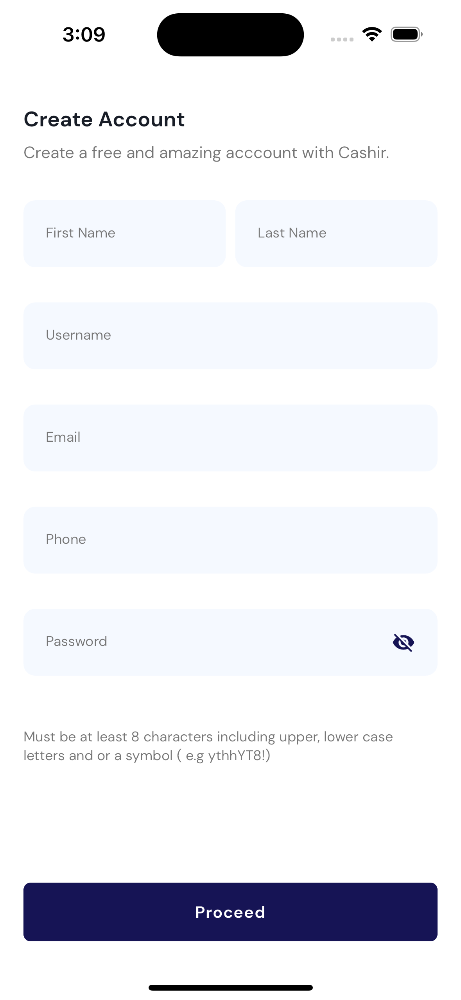
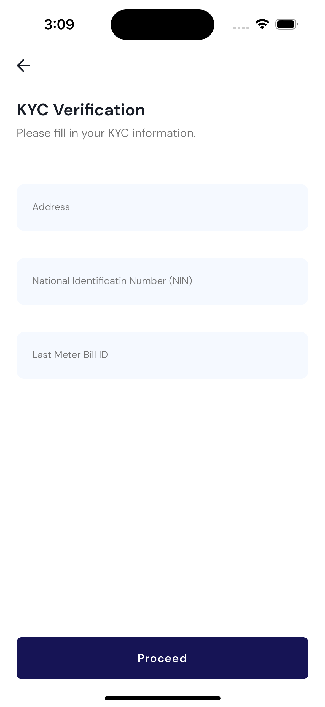
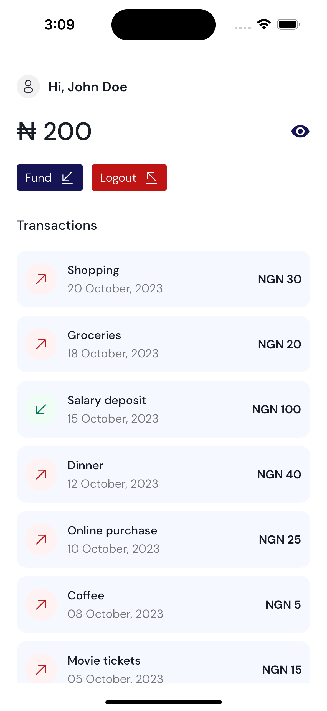
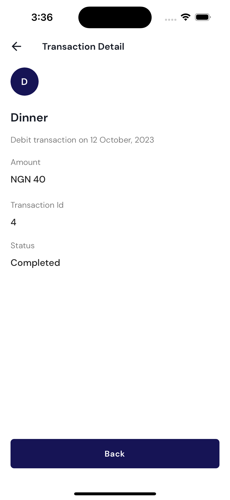

# Cashir Mobile Engineer Assessment


## Installation
1. Find attached an apk file in the "apk" folder directory of the project.

or 

1. Make sure you have [Flutter](https://flutter.dev/docs/get-started/install) and its dependencies installed on your device.
2. Clone the repository: `git clone https://github.com/yourusername/my-app.git`
3. Go to the project directory: `cd my-app`
4. Run `flutter pub get` to install the dependencies.
5. Run `flutter run` to start the app on an emulator or connected device.


## User Interface
The application features the principle "Component Driven Design" which enables a clean and user-friendly interface, with widgets broken down into several components, following the DRY principle to enable easier maitenance and usabiliy.

## Technical details
- Cahir is built with Flutter, using the Dart programming language.
- The major state management used is Streams & RxDart.
- The app intends to follows functional, object oriented and interface-based programming paradigms.


## Feature Interface
- [x] Get Started 
- [x] Sign Up
- [x] Kyc Verification
- [x] Home Dashboard


## Screenshots

| Get Started Screen | Create Account | 
|    :---:     |     :---:      |  
|    |    |

| KYC Verification  | HomePage  | 
|    :---:     |     :---:      |  
|    |    |

| Transaction Analytics | 
|    :---:     |   
|    | 

## Running Tests 

To run all unit tests use the following command:

```flutter test```
